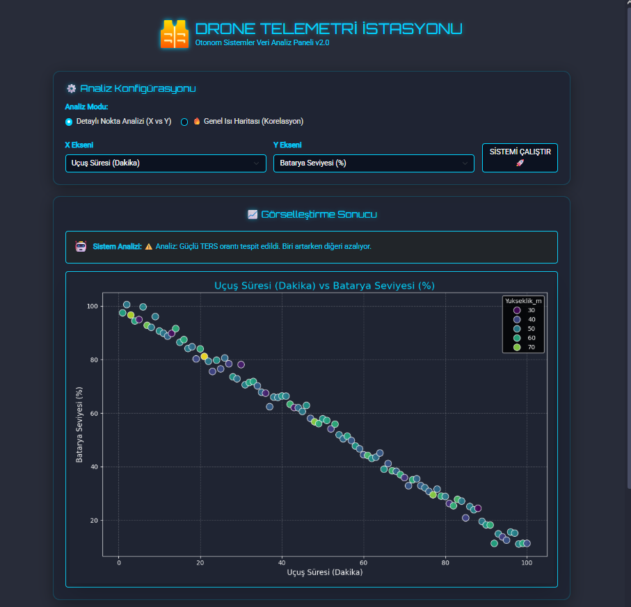

# 🚁 Drone Telemetri & Analiz İstasyonu (Flask Dashboard)

Bu proje, **Python Flask** altyapısı kullanılarak geliştirilmiş modern bir yer kontrol istasyonu arayüzüdür. Drone uçuş loglarını (CSV) analiz eder, **Seaborn** ile görselleştirir ve **Pandas** ile istatistiksel verileri sunar.

  

## 🎯 Proje Özellikleri
* **Dinamik Görselleştirme:** Seçilen parametrelere (Hız, İrtifa, Batarya vb.) göre anlık grafik çizimi.
* **İleri Analiz Modları:**
  * 🔵 **Nokta Analizi (Scatter):** İki değişken arasındaki ilişkiyi detaylı inceler.
  * 🔥 **Isı Haritası (Heatmap):** Tüm sistemin korelasyon matrisini çıkarır.
* **AI Simülasyonu:** Veriler arasındaki ilişkiyi yorumlayan basit karar algoritması.
* **Dark Mode UI:** Otonom sistemler konseptine uygun modern, karanlık tema.



## 🚀 Kurulum ve Çalıştırma

Projeyi bilgisayarınıza klonlayın:

git clone [https://github.com/KULLANICI_ADINIZ/drone-dashboard.git](https://github.com/KULLANICI_ADINIZ/drone-dashboard.git)
cd drone-dashboard

Gerekli kütüphaneleri yükleyin:

    pip install -r requirements.txt

Uygulamayı başlatın:
    python app.py

Tarayıcınızda http://127.0.0.1:5000 adresine gidin.

## 📂 Proje Mimarisi
```text
drone-dashboard/
├── app.py              # Backend Motoru (Flask & Seaborn)
├── requirements.txt    # Kütüphane Listesi
├── drone_logs.csv      # Simülasyon Verisi
├── static/             # CSS ve Resimler
└── templates/
    └── index.html      # Frontend Arayüzü (Jinja2)

Geliştirici: Sefa Taşdemir | 2025
