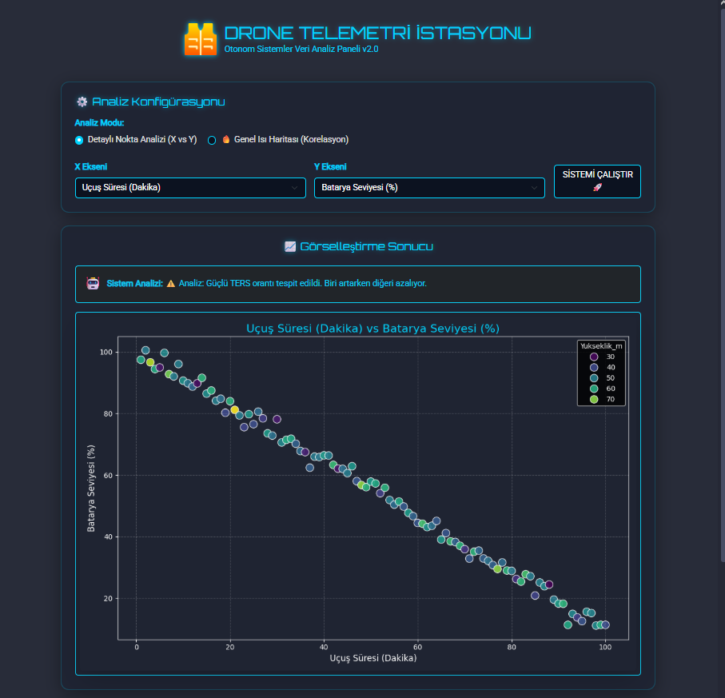

# Drone Telemetry & Analysis Dashboard

A lightweight ground-station-style web dashboard for exploring drone flight logs, visualizing telemetry, and inspecting relationships between flight parameters.

## Overview

The project combines a small Flask backend with a browser-based interface for analyzing CSV telemetry data. It is intended as a compact software/data-visualization project in an autonomous-systems context.

## Features

- visualize telemetry such as speed, altitude, and battery level
- compare two variables with scatter plots
- inspect correlations between telemetry fields
- generate a correlation heatmap
- display lightweight rule-based interpretations of selected relationships
- work with CSV flight logs through Pandas
- dark-themed web interface



## Tech Stack

- Python
- Flask
- Pandas
- Seaborn
- HTML / CSS
- Jinja2

## Application Flow

```text
CSV flight log
    ↓
Pandas processing
    ↓
Flask backend
    ↓
Charts and statistics
    ↓
Browser dashboard
```

The project focuses on simple, inspectable telemetry analysis rather than real-time vehicle control or live ground-station communication.

## Running Locally

```bash
git clone https://github.com/sefatasdemir22/drone-telemetry-dashboard.git
cd drone-telemetry-dashboard
pip install -r requirements.txt
python app.py
```

Then open:

```text
http://127.0.0.1:5000
```

## Project Structure

```text
drone-telemetry-dashboard/
├── app.py
├── requirements.txt
├── drone_logs.csv
├── static/
├── templates/
│   └── index.html
└── README.md
```

## Purpose

This project demonstrates lightweight backend development, data processing, and technical visualization using telemetry-oriented data. It complements my robotics work by focusing on the software layer used to inspect and communicate system behavior.
